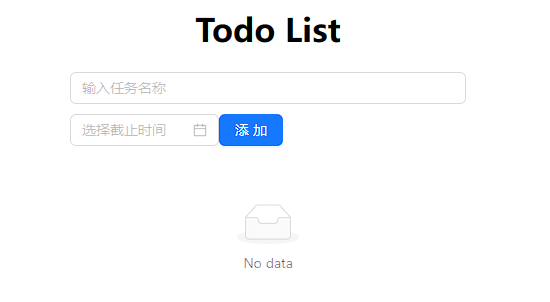
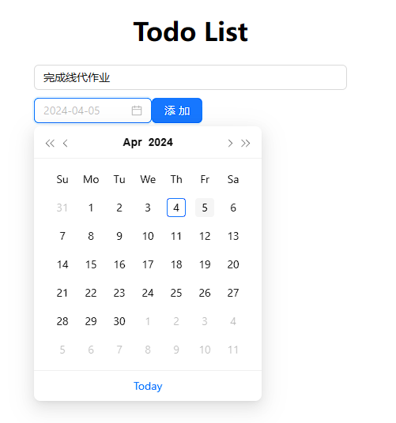
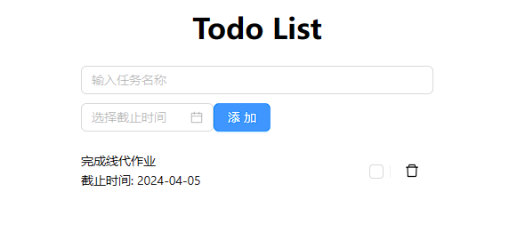
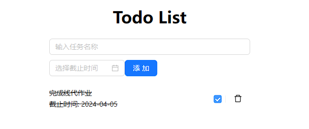
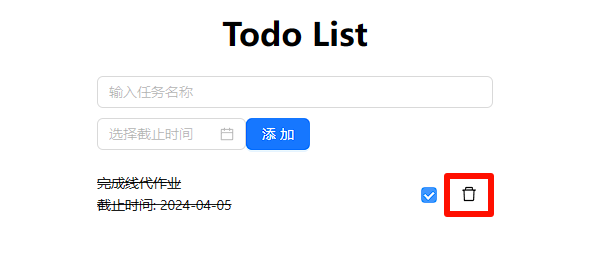
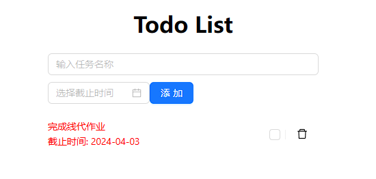
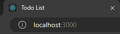
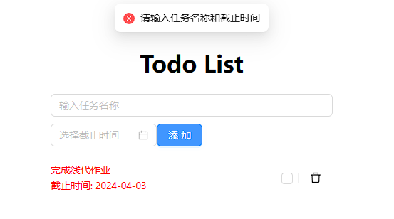

# OurEDA 实验室 2023 级 Web 方向期中作业

22-ly

## 前言

感谢您继续选择 Web 作为您的学习方向，在您完成本次作业之前请务必仔细阅读本文档以免您完成的内容与实际要求有所出入。

## 作业需求

本次作业要求您使用 React 前端库 和 Ant Design 组件库实现一个 Todo List，包括待办任务的添加、删除、状态更新等，示例页面如下：

[项目Demo视频](./videos/Demo.mp4)

## 作业要求

1. 请自行创建 React 项目完成作业，请遵守模块化设计理念，合理设计功能模块，并规范文件和文件夹命名
2. 请使用 React 的**函数式组件**进行代码编写，使用 `useState()`，`useEffect()`等钩子函数引入 React 特性
3. 作业**全过程**请使用 Git 进行版本控制
4. 请严格规范自己的代码风格，包括缩进、变量命名、函数命名等，尽可能使代码整洁而具有较高可读性

## 具体任务

1、可选待办任务的任务名称，截止时间

2、显示出待办任务的名称和截止时间

3、可通过复选框标记任务的完成情况，已完成的用删除线标记

4、可进行任务的删除

5、逾期任务用红色文字标记

6、修改网页标题为：Todo List

7、在任务名称和截止时间输入不全时添加任务弹出提示框

## 提示

可以使用 Ant Design 的 List，Checkbox，Button，Input，DatePicker，message 组件和 DeleteOutlined 图标

判断任务是否逾期可以使用 moment 库

## 可选项

以下要求为作业的可选项，不要求必须实现

1. 将 Todo List 保存在本地 JSON 文件中以实现项目重启后可以保留上次状态
2. 迁移状态逻辑至 Reducer 中